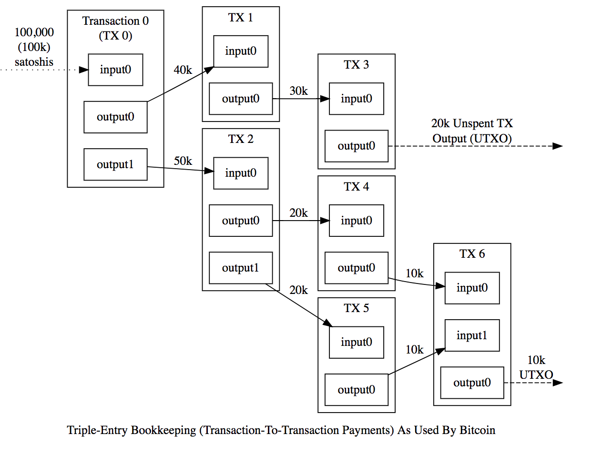

# Assignment
This is assignment is structured to help you become familiar with blockchains and how they work, specifically Bitcoin.  Bitcoin uses a mechanism of unspent transaction outputs (UTXOs) for keeping track of values on the blockchain.  You will become familiar with wallets, address, private keys, signing transactions, as well as the UTXO model.  Through out this excercise there will be a number of ***Assignment Deliverable XX:*** . This will tell you what you need to turn in at the end of the assignment.  If there are more than one items required for that deliverable add a blank line between them. The format of the submitted work should be a text file with you name, date, assignment name, and UT ID. There should be sections of indicated by Assignment Deliverable XX: followed by the deliverable information.  For example:

Karl, Kreder            01/25/2019             Intro_to_Bitcoin_Command_Line            UTID

Assignment Deliverable 1:

mhpt1x5Ro8SSMAQrkXwCj4F6sZd1xL9nsT

H9v014McOc0+ESiyWMWJ2lBcGi+Vd+O0/IqSR0mdt15IEK7z158PKkD8JeRe5j4n29+Gyu2m5F3qPWwHQuAPS90= 

Hello, Bitcoin

Assignment Deliverable 2:

....


# Tools
First, you will need to install the bitcoin client on your machine.  Directions for doing so can be found for the different operating systems in the links below.  Once you have validated that you have appropriately installed bitcoin, please proceed to the directions for configuring your installation to work with the test net before syncing. <br><br>

## MacOS
The commands in this guide should be executed in a Terminal application.
The built-in one is located in `/Applications/Utilities/Terminal.app`.

### Preparation

Install the macOS command line tools:

`xcode-select --install`

When the popup appears, click `Install`.

Then install [Homebrew](https://brew.sh).

### Dependencies

`brew install automake berkeley-db4 libtool boost miniupnpc openssl pkg-config protobuf python qt libevent qrencode`

See [dependencies.md](dependencies.md) for a complete overview.

### Build Bitcoin Core

1. Clone the Bitcoin Core source code:

        git clone https://github.com/bitcoin/bitcoin
        cd bitcoin

2.  Build Bitcoin Core:

    Configure and build the headless Bitcoin Core binaries as well as the GUI (if Qt is found).

        ./autogen.sh
        ./configure --without-gui
        make

3.  It is recommended to build and run the unit tests:

        make check

## Linux
The following instructions describe installing Bitcoin Core on Linux systems. Perform the following in your terminal or emulator.

Type the following line to add the Bitcoin Personal Package Archive (PPA) to your system:

`sudo apt-add-repository ppa:bitcoin/bitcoin`

You will be prompted for your user password. Provide it to continue. Afterwards, the following text will be displayed:

```BASH
Stable Channel of bitcoin-qt and bitcoind for Ubuntu, and their
dependencies

Note that you should prefer to use the official binaries, where possible, to
limit trust in Launchpad/the PPA owner.

No longer supports precise, due to its ancient gcc and Boost versions.
More info: https://launchpad.net/~bitcoin/+archive/ubuntu/bitcoin
Press [ENTER] to continue or ctrl-c to cancel adding it
```

Press enter to continue. The following text (with some variations) will be displayed and you will be returned to the command line prompt:

```BASH
gpg: keyring `/tmp/tmpixuqu73x/secring.gpg' created
gpg: keyring `/tmp/tmpixuqu73x/pubring.gpg' created
gpg: requesting key 8842CE5E from hkp server keyserver.ubuntu.com
gpg: /tmp/tmpixuqu73x/trustdb.gpg: trustdb created
gpg: key 8842CE5E: public key "Launchpad PPA for Bitcoin" imported
gpg: no ultimately trusted keys found
gpg: Total number processed: 1
gpg:               imported: 1  (RSA: 1)
OK
```

Type the following line to get the most recent list of packages:

```BASH
sudo apt-get update
```
This step may take several minutes.

Install the Bitcoin Core daemon (bitcoind) using the following:

```BASH
sudo apt-get install bitcoind
```
If there are no errors during installation proceed to configuration to configure the installation to operate on the Bitcoin testnet and then test the installation.

# Configuration

You will now need to create a configuration file to run the Bitcoin daemon connected to the testnet.  The following are the default locations for configuration files for both MacOS and Linux.<br>
 
**Linux**	$HOME/.bitcoin/bitcoin.conf<br><br>
**Mac OSX**	$HOME/Library/Application Support/Bitcoin/bitcoin.conf<br><br>

Use your favorite text editor or IDE to create a the bitcoin.conf file in the appropriate location.  Write the following to the bitcoin.conf file and save.<br>

``` BASH
# Run on the test network instead of the real bitcoin network.
testnet=1

# Listen for RPC connections on this TCP port:
rpcport=18332
```
## Add aliases
Aliases will allow us to access the bitcoind and bitcoin-cli without having to specify the full path.  To set the aliases, execute the following to update your .bash_profile. **Note:** aliases are different for Mac and Linux.

### MacOS
```BASH
cat >> ~/.bash_profile <<EOF
alias btcdir="cd ~/Library/Application Support/Bitcoin" #MacOS default bitcoind path
alias bc="~/bitcoin/src/bitcoin-cli"
alias bd="~/bitcoin/src/bitcoind"
alias btcinfo='bc getwalletinfo | egrep "\"balance\""; bc getnetworkinfo | egrep "\"version\"|connections"; bc getmininginfo | egrep "\"blocks\"|errors"'
EOF
```

### Linux
```BASH
cat >> ~/.bash_profile <<EOF
alias btcdir="cd ~/.bitcoin/" #linux default bitcoind path
alias bc="~/.bitcoin/bitcoin-cli"
alias bd="~/.bitcoin/bitcoind"
alias btcinfo='bc getwalletinfo | egrep "\"balance\""; bc getnetworkinfo | egrep "\"version\"|connections"; bc getmininginfo | egrep "\"blocks\"|errors"'
EOF
```

Reload your .bash_profile for aliases to take effect.
```BASH
source ~/.bash_profile
```

## Start bitcoind
Use the following command to start the bitcoin daemon:
```BASH
bd
```

Monitor the status of bitcoind in a new terminal tab using the tails command:

**MacOS:**<br>
```BASH
tail -f ~/Library/Application\ Support/Bitcoin/testnet3/debug.log
```

**Linux:**<br>
```BASH
tail -f ~/.bitcoin/testnet3/debug.log
```

You should see new blocks being written to the log. 

## Check bitcoin-cli installation
To check to see if bitcoin-cli is working correctly with bitcoind, open another new terminal tab and type the following command:

```BASH
bc help
```

If you see a list of commands you are good to go.  If you get an error something went wrong. This could be caused by one of the following things.

1) The blockchain is not yet synced.  Check the status by using the tails command above. 
2) The bitcoin.conf file is not correctly written. Make sure this is done correctly and in the correct path.
3) bitcoind is not currently running.  Look at your system processes and make sure you see bitcoind.
4) The alias paths are not correctly setup.  
5) If all else fails, try google, a friend, or ask your friendly TA.

You are now ready to start using bitcoin-cli.  However, you will need to wait for you bitcoind instance to sync before you can make transactions. Syncing will take ~1 hour.  You can just leave you machine on and come back after dinner. 

Here are some example commands to try out with bitcoin-cli:
```BASH
bc getblockchaininfo
bc getmininginfo
bc getnetworkinfo
bc getnettotals
bc getwalletinfo
```
# Using Bitcoin!
## Generate a wallet
Before we can do anything with 
```BASH
$ bitcoin-cli getnewaddress "" legacy
2Mz6bRRUV5kfDUv87FFaPAgqMECDuMQn9ta
```
Now that you have a wallet, you will need to get an address from your wallet.  The wallet in this case is a hierarchical deterministic (HD) wallet which you can find out more about by reading Bitcoin Improvement Proposal (BIP) 32 https://github.com/bitcoin/bips/blob/master/bip-0032.mediawiki . 

**Note:** All bips proposed and implemented can be viewed at https://github.com/bitcoin/bips.  These are often the best source of information when trying to learn about or understand a feature of Bitcoin without having to read the source code. 

A HD wallet is a set of addresses which is generated from a single master seed using a hierarchical deterministic process.  So a wallet can have many types of coins, such as Bitcoin, Bitcoin Testnet, Litecoin, et cetera.  A wallet can also organize the addresses for a specific coin type into accounts.  Where the account will have many addresses for that coin type.  This may all seem confusing but you can learn more at https://github.com/bitcoin/bips/blob/master/bip-0044.mediawiki.  But for now you can simply think of wallets as having many addresses.

Before we can use our newly generated wallet, we will need to get an address from our wallet. To do this you will need to get a recieve address from your wallet.  This can be done by using the `getnewaddress` command, but to make things simpler lets save the result as a variable so we can access it easily in the future.

```BASH
unset NEW_ADDRESS_1
$ NEW_ADDRESS_1=$(bitcoin-cli getnewaddress "" legacy)
```

These commands clear the NEW_ADDRESS_1 variable, then fills it with the results of the bitcoin-cli getnewaddress command. The flag legacy is used here because some of the features of bitcoin-cli are not yet supported for "new" seg-wit addresses. You can tell that this is a legacy address because it starts with a n or m rather than a 2.

You can then use your shell's echo command to look at your (new) address:
```BASH
$ echo $NEW_ADDRESS_1
2Mz6bRRUV5kfDUv87FFaPAgqMECDuMQn9ta
```

## Get some 'testnet' Bitcoin

The following website will send you some testnet bitcoin so that you can play around and learn how to use Bitcoin.  

https://coinfaucet.eu/en/btc-testnet/

Enter your bitcoin address and fillout the captcha. Once it shows that it is sending some testnet bitcoin you can check the status of the transaction at:

https://live.blockcypher.com/

Select "Bitcoin Testnet" in the search menu and enter your Bitcoin address

You should see a test faucet transaction sending money to your wallet.  If not, wait for a few minutes and refresh.  The reason that you will potentially need to wait is that you transaction must be included in a block.  Bitcoin blocks are found using a stochastic process of [mining](https://www.investopedia.com/tech/how-does-bitcoin-mining-work/) where blocks are typically found every 10 minutes.  There can be a significant deviation in any given block time ranging from 1 minute to 60 minutes is not atypical. To check on the progress of the Bitcoin testnet blocks you can go to https://live.blockcypher.com/btc-testnet/ and see when the last block was found.

### Explore your wallet while you wait
Now that you have a wallet you will need to back it up.  Future assignmets will require you to "turn-in" your work by executing a transaction on the blockchain from one of the addresses in this account.  Therefore, you will need to back-up your wallet. You can do this by running:

```BASH
bc backupwallet backup.dat
```

Locate this file on your computer and save it in a safe location.  If in the future you need to restore your wallet you can do so by importing the wallet using:

```BASH
bc importwallet backup.dat
```

To better understand what is going on in the background we can dump the wallet in plaintext format.  To do this run:

```BASH
bc dumpwallet ~mywallet.txt
```

Open the resulting file in your text editor.  You will see something like the following:

```BASH
cQ4qpkvWCRvZaxGgbitZs5RJCBGoL9g1mqQmsssRw93F3WbybPqY 2019-01-20T04:37:24Z reserve=1 # addr=2N1cjToNQPX4JHQTJNLz94TFa8bcEseoPuQ hdkeypath=m/0'/0'/195'
cRCvHdRZaEfjtgC15s7AV7nKwVxpUDumRJPeTfawwLEmhPVwCyHc 2019-01-20T04:37:24Z reserve=1 # addr=2NA18oui36UXLdeyzViDCtZxZSvKnRK6782 hdkeypath=m/0'/0'/691'
cTrEobtoAuq3Zw6NbR1n6xvPSoCY5Bqu7FHHqmmbf3Yzc1zbEP2T 2019-01-20T04:37:24Z reserve=1 # addr=2NBbat4jgaLmXYnPPvdXhw1Gmanm66FWnJi hdkeypath=m/0'/0'/672'
cTGS9GLiSmmFv6uUAGYhmAyBC5tfNv2uHQT4SDJMgD6mChb3dvD4 2019-01-20T04:37:24Z reserve=1 # addr=2N5TfhrXWVVg6g4GMfG99XBt84Fx2ZPhtM8 hdkeypath=m/0'/0'/475'
cPTDBf9G73476d1k2BKRQptKUnF1NHeKcwqUeK66BNTHNnZty1o5 2019-01-20T04:37:24Z reserve=1 # addr=2N8oTz3XKpp7QVuSGiArxWYWF9PAYRn3Fcp hdkeypath=m/0'/0'/430'
cTHDfPzfN6TKXFtXFnmCqEtq4erTR7t6n1VmnUJX1PJHcip3D2Tu 2019-01-20T04:37:24Z reserve=1 # addr=2N1M9KJu6AtU62tEVstytZcZMYTrkYDDxoM hdkeypath=m/0'/0'/273'
cV1cYg7nYbyyAVWpiaEgXTT2XCGsDxiMVig9bdTbipFhGUHX6BZk 2019-01-20T04:37:24Z reserve=1 # addr=2NCHHAc7ykgpvsbVdsgy9jRPX6eth4nV65K hdkeypath=m/0'/0'/712'
cPsbCqpytvwtqe4YA1hJkopiK57bCCCcSBqRdiJJRxEuXcwvZ8hr 2019-01-20T04:37:24Z reserve=1 # addr=2MzUs5uaMXM8ye8WuovqBFW8h8v8p3rdHHg hdkeypath=m/0'/0'/729'
cPULsxLpi6vHoxayNMuiGp9yRcCksftEPbWhojCFF3mpXKtdkjSU 2019-01-20T04:37:24Z reserve=1 # addr=2N1rTT1Uh8ChfvFF7QEAPUvwBZaQBaiFM46 hdkeypath=m/0'/0'/307'
```

Go ahead and search for your address that you used to get your testnet bitcoin.  If you already forget it you can find it by `echo NEW_ADDRESS_1`.  You should find it and at the end of the line you will see that `hdkeypath=m/0'/0'/0'`.  This is the first address in your HD wallet tree.  The value to the left, (e.g.  is the private key corresponding to this address which needs to be used to move Bitcoin from this address.  

Lets get a new address and see what happens.

```BASH
unset NEW_ADDRESS_2
NEW_ADDRESS_2=$(bitcoin-cli getnewaddress "" legacy)
```
```BASH
$ echo $NEW_ADDRESS_1
mhpt1x5Ro8SSMAQrkXwCj4F6sZd1xL9nsT
```
If you search for this value in your wallet file you should find that it appears in the line with `hdkeypath=m/0'/0'/1'`.  This is the second address in your HD wallet.  You can use address in Bitcoin multiple times, howeever privacy is better perseved if addresses are not reused. This is one of the reasons for an HD wallet.  If you look at the top of the file you will see that there is similar to:

```BASH
# extended private masterkey: tprv8ZgxMBicQKsPdNtUXyQ3x2h9AJpp1EDayZsSHFj52HXPjRdehHDqADx7kJ8ZNf7AhbchZXAj2CRczMYMVXxXeSNPkwWYhjESRRDR98TSwnN
```

The beauty of HD wallets is that as long as you have this line, you can re-derive the rest of the file by changing the `hdkeypath`. This gives Bitcoin users the ability to manage a single secret but derive an infinite number of addresses which they can use easily. I will also mention here, that if you have actual bitcoin in your wallet, you do not want to **share this file or your masterkey with anyone**.  The ownership of bitcoin is the posession of this private key and the ability to sign transactions with it.  Therefore, if anyone else gets your private keys, or your wallet.dat file, they have your Bitcoin.

### Signing a message
***Assignment Deliverable 1:*** You will need to sign a message with an account that is your UT ID and submit the message and the account to your TA. You will use this account for the rest of your deliverables.

The heart of Bitcoin, blockchain, and any cryptocurrency is signing messages with private keys that can then be verified by using a public key.  A bitcoin address is a representation of a public key and a bitcoin transaction is like a check that tells the network to move money from one account to the other.  The check is signed using an addresses corresponding private key, and if the signature is valid, the miners update the ledger as long as the transaction meets the rules of consensus.

In addition to being able to sign Bitcoin messages, you can also use the same keypairs to sign any abitrary message.  This can be done using the following:

```BASH
$ bc signmessage "mhpt1x5Ro8SSMAQrkXwCj4F6sZd1xL9nsT" "Hello, Bitcoin!"
H9v014McOc0+ESiyWMWJ2lBcGi+Vd+O0/IqSR0mdt15IEK7z158PKkD8JeRe5j4n29+Gyu2m5F3qPWwHQuAPS90=
```
The veracity of the message can be checked by using `verifymessage "address" "signeddata" "message"`.

```BASH
$ bc verifymessage "mhpt1x5Ro8SSMAQrkXwCj4F6sZd1xL9nsT" "H9v014McOc0+ESiyWMWJ2lBcGi+Vd+O0/IqSR0mdt15IEK7z158PKkD8JeRe5j4n29+Gyu2m5F3qPWwHQuAPS90=" "Hello, Bitcoin"
true
```

### Back to your transaction

Once you see the transaction on the testnet, go back to the command line and enter

```BASH
bc getwalletinfo
```

you should see a result similar to the following:

```BASH
{
  "walletname": "wallet.dat",
  "walletversion": 159900,
  "balance": 0.08203474,
  "unconfirmed_balance": 0.00000000,
  "immature_balance": 0.00000000,
  "txcount": 1,
  "keypoololdest": 1547959045,
  "keypoolsize": 999,
  "keypoolsize_hd_internal": 1000,
  "paytxfee": 0.00000000,
  "hdmasterkeyid": "3aee71d488da5d8547e22087f7d577136d7f4a80"
}
```

You will note that the "balance" field is no longer 0 because you have recieved testnet Bitcoins from the faucet. You can see that your wallet currently has 1 transaction and has a keypool of 999 keys. To learn more about the wallet.  Try out these commands:

```BASH
bc listtransactions
bc listunspent
bc getrawtransaction
bc decoderawtransaction
```
This will tell you information about the transactions, your unspent transaction outputs (UTXOs) as well as letting you see the raw transaction data.

***Assignment Deliverable 2:*** Using the commands above, find your transaction ID and then use that to find the hex of your transaction as well as the JSON interpreted output of the transaction.  You will submit the transaction ID, the hex, and the JSON output.

## Making a simple transaction

Now that you have your wallet setup and you have some testnet Bitcoin lets go ahead and make a simple transaction. For this transaction, you will be sending money to your TAs using this address `mgct4AqGBPNxigwWnbZnJLL8YpxTEkF3eA`. 

You can send money simply by:

```BASH
$ bc sendtoaddress mgct4AqGBPNxigwWnbZnJLL8YpxTEkF3eA 0.01
49377bf7e2d6524ebaeef8eec67db3fe22dc57dcced9f63d5bd89e021b983edb
```
The result is the transaction ID.  You can learn more about the transaction ID by using:

```BASH
 $ bc gettransaction 49377bf7e2d6524ebaeef8eec67db3fe22dc57dcced9f63d5bd89e021b983edb
{
  "amount": 0.00000000,
  "fee": -0.00000168,
  "confirmations": 0,
  "trusted": true,
  "txid": "49377bf7e2d6524ebaeef8eec67db3fe22dc57dcced9f63d5bd89e021b983edb",
  "walletconflicts": [
  ],
  "time": 1548631273,
  "timereceived": 1548631273,
  "bip125-replaceable": "no",
  "details": [
    {
      "account": "",
      "address": "mpzUA2rLE64aTwSDbVC8Ght6gADbruTTqK",
      "category": "send",
      "amount": -0.01000000,
      "label": "",
      "vout": 0,
      "fee": -0.00000168,
      "abandoned": false
    },
    {
      "account": "",
      "address": "mpzUA2rLE64aTwSDbVC8Ght6gADbruTTqK",
      "category": "receive",
      "amount": 0.01000000,
      "label": "",
      "vout": 0
    }
  ],
  "hex": "02000000000101611fbe48bfd8ec6b8c0cbdb66432486a7c9430dda1062af8b657615bc0ffcfa50000000017160014467b8e642ef4659cc5c9f2dbeed51696ee98b458feffffff0240420f00000000001976a91467ed4a521f8a3d32a373b7d33ea9b942fb215e3288ac6a5166000000000017a914ce16f0dc82a233f433063018057c68be7a1dc1918702483045022100f6b9c8ae54aca7e9df3d6ae17e0971e2ee7535bf0840b28c02e86ff8fd15dfa6022068c8441252a47c8294357246ee0dab4b977669530ae31daec37e1922fd79883d0121030a830e465562709ddcdc1e397af9098c1ff862ba98f3a8cfd5ffb9c95c9141eb5d301600"
}
```

This shows that we sent 0.01 BTC to mpzUA2rLE64aTwSDbVC8Ght6gADbruTTqK.  However, there is a significant ammount of information that is hidden in the transaction hex field.  To learn more about it lets lookup the transaction on https://live.blockcypher.com/btc-testnet/ and see what we can figure out.


BTW Congratulations! You have just made a Bitcoin transaction.  You have seen this happen on a block explorer and can conjure the power of magic internet money!

So what can we see from from the block explorer.  There is one input to the transaction and two outputs from the transaction.  If we go use `bc listunspent` you will see that you no longer have one UTXO but you rather have one new one and the old UTXO is no longer displayed.  This is because the UTXO was consumed in this transaction when it was used as an input.  This also helps explains why there are two outputs.  The first output is you sending the 0.01 to your TAs.  The TAs now have that UTXO. The second output is the change that is being sent back to your wallet.  If you wanted you could have sent the change back to the original address, however this is considered bad practice from a privacy perspective so by default bitcoin-cli sent the change to a new address in your wallet. 

This is a visual summary of what you are seeing in your wallet. If you would like to read a bit more on UTXOs and how this differs from an account model, this is a reasonable intro https://medium.com/@sunflora98/utxo-vs-account-balance-model-5e6470f4e0cf



In addition to the UTXOs we can also see that a fee was paid to the miners so that they include the transaction in a mined block. In this case the fee was 0.00000168.  The value of the input was 0.07705682 and the value of the outputs was 0.06705514 and 0.01.  The input value is equal to the sum of all of the output values and the transaction fee.  Therefore, no money was created or destroyed in this transaction. 

***Assignment Deliverable 3:*** Find the transaction ID in which you sent your TAs 0.01 BTC and submit it.

### What just happened?

To make this transaction happen alot of things are being done for you by bitcoin-cli behind the scene. This includes selecting which UTXO to spend, calculating the transaction fee, building the transaction, signing the transaction, and broadcasting the transaction.  In the subsequent sections you will learn all about this process because we are going to build a transaction piece by piece.

# Building transactions

## One input, One output

The simplest transaction that we can build involves using a single input and a single output.  First we will need to list all of our outputs and choose an input to send.

```BASH
$ bc listunspent
[
  {
    "txid": "1b315179a1f750e444cc410971f9bb2dcd1e5f0679aee70cb1741f0890799308",
    "vout": 1,
    "address": "2Mu8ciAruGtBrBCQVRqh5SsZBk3G2Nh7Ns9",
    "account": "",
    "redeemScript": "00148c20a264b1c162f388fe0e9992e2e87d1830adef",
    "scriptPubKey": "a91414b04eaf44e821cb570a07c74e37ad23189c1ca487",
    "amount": 0.08770812,
    "confirmations": 48,
    "spendable": true,
    "solvable": true,
    "safe": true
  }
 ]
 ```
 
At this point the choice of which UTXO to use should be pretty easy, because you should only have 1.  However, this choice can become complex when you are managing a wallet with many inputs and outputs.  A general rule is that you want to use the oldest UTXO first. However, this can be complicated in situations where you want to manage the amount of 'dust' (small value UTXOs) in your wallet.  Each time you include a transaction into the blockchain you are paying a per byte transaction fee.  Therefore, you want to keep your UTXOs organized is a way that makes economic sense.  If I send a transaction for this UTXO worth 0.08770812 and I need to send 0.0876 with a tx fee of 0.0001 I will end up with change of 0.00000812.  This change is not very "good" because of its size relative to reasonable transaction fees.  I could include this input with another input to lower the number of bytes per input in my transaction making this a more economically viable UTXO. The fact remains, that I want to make try and use my UTXOs wisely so as not to create 'dust'.
 
Lets go ahead and pick this as the UTXO we want to use in our transaction. Since we only want to have one output, we will send the entire amount of this UTXO to a new address minus the transaction fee.  The transaction fee is not explicitly set, but is rather the cumulative difference between the inputs and the ouputs.  Therefore, you want to be careful with you math as not to pay an astronomically high fee.

Lets go ahead and collect the strings we will need to make a transaction. Note that my output value is 0.0001 lower than my input reflecting the value of the transaction fee.

```BASH
$ UTXO_ID=1b315179a1f750e444cc410971f9bb2dcd1e5f0679aee70cb1741f0890799308
$ UTXO_VOUT=0.08770812
$ NEW_ADDRESS=mywBT1RBVqhzCTQpc3pycbJkM7v1tagQdA
```

To make build the transaction we will use `createrawtransaction` as follows:

```BASH
$ bc createrawtransaction '''[ { "txid": "'$UTXO_ID'", "vout": '$UTXO_VOUT' } ]''' '''{ "'$NEW_ADDRESS'": 0.08760812 }'''
020000000108937990081f74b10ce7ae79065f1ecd2dbbf9710941cc44e450f7a17951311b0100000000ffffffff01ecad8500000000001976a914ca073a588b2ea809fcfe4aae9f89fa73acf4117788ac00000000
```
We can now set a value for our raw transaction hex:

```BASH
RAW_TX=020000000108937990081f74b10ce7ae79065f1ecd2dbbf9710941cc44e450f7a17951311b0100000000ffffffff01ecad8500000000001976a914ca073a588b2ea809fcfe4aae9f89fa73acf4117788ac00000000
```

 
https://testnet-faucet.mempool.co/

To do this you will need to generate a new address. You will then need to setup some of the default configuration values for bitcoin-cli by adding these lines to your bitcoin.conf file.

```BASH
mintxfee=0.00001
txconfirmtarget=6
```


